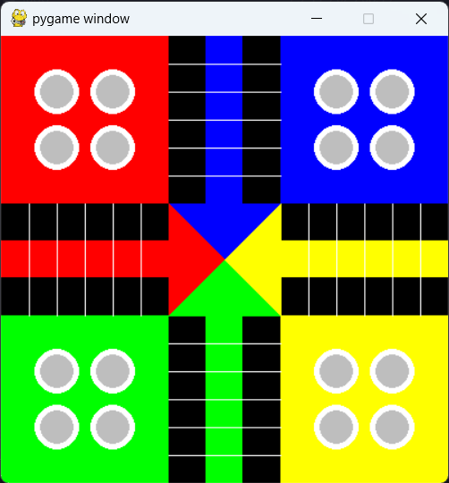

<h1 align="center">Ludo_ai</h1>

 
  

  &#xa0;

  <!-- <a href="https://ludo_ai.netlify.app">Demo</a> -->

## Introducing our AI Ludo Player!

This AI isn't your average player—it's a learning machine. Using reinforcement learning, it plays millions of games against itself, always striving to find better ways to win. What's impressive is its multitasking ability—it can handle many games at once, speeding up its learning process.

In this repository, explore how the AI learns. See its games, decisions, and how it evolves its strategies. Whether you're curious about AI or a Ludo enthusiast, join us in discovering the world of AI-powered Ludo. Let's uncover the secrets of smart gameplay together!